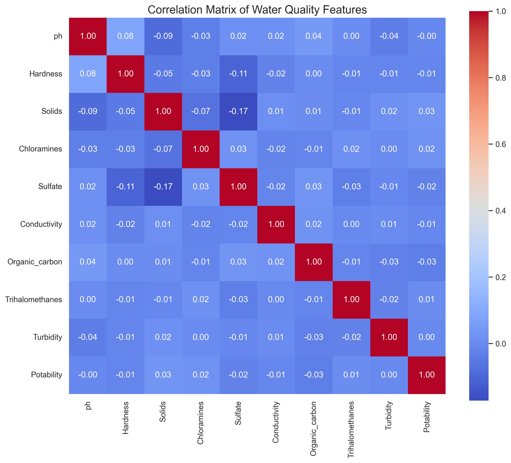
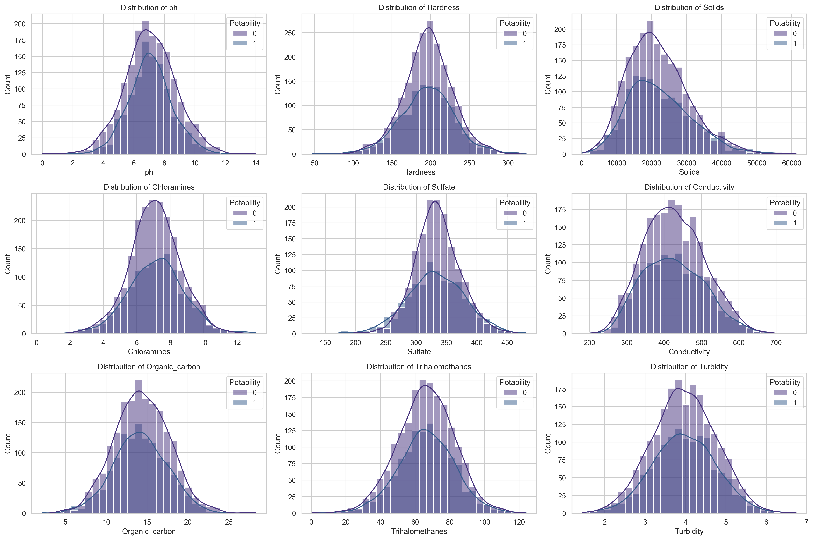
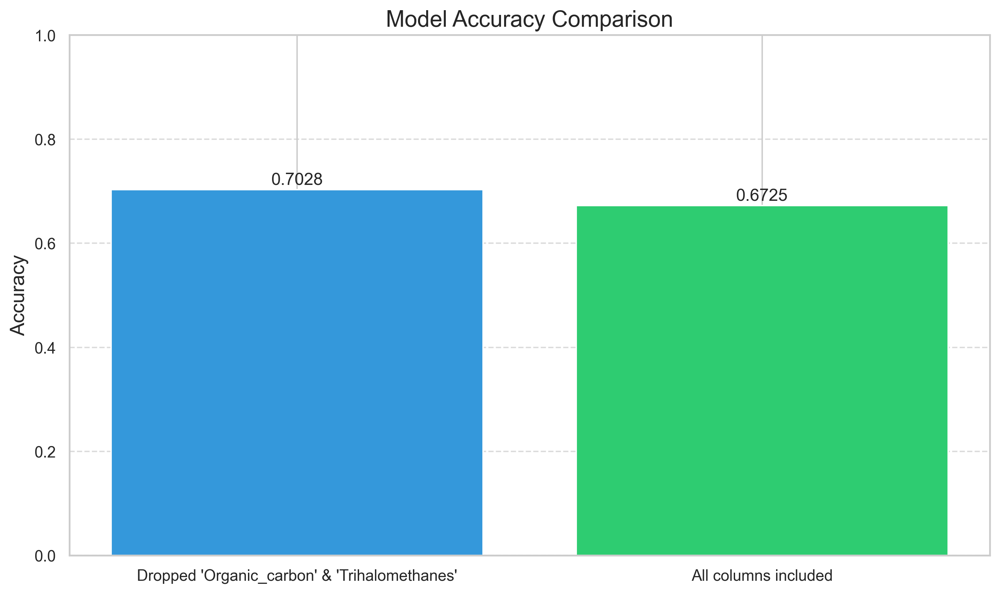
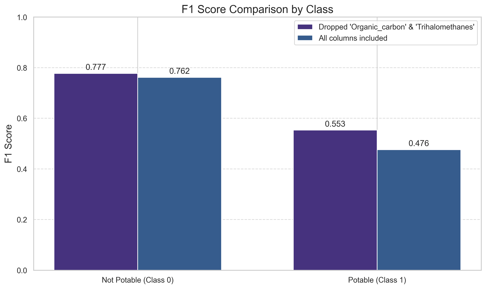
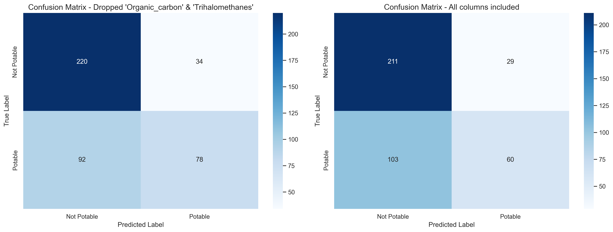

# Machine Learning for Water Quality Assessment: Predicting Potability and Proposing a Low-Cost Monitoring Kit for Rural Uzbekistan

Welcome to an open-source repository providing source code for the paper:

> **Machine Learning for Water Quality Assessment:
Predicting Potability and Proposing a Low-Cost Monitoring
Kit for Rural Uzbekistan**  
> by *Artyom Tashyan, Sarvar Bazarov, Samanbek Erkinov*


**Important Files and Directories**:

- **`data/`**: Data used to train the model
- **`graphs/`**: Files of graphs generated in `.ipynby` file
- **`model.ipynb`**: Notebook containing data analysis scripts and the Histogram-based Gradient Boosting Classification model to predict whether water is potable or not

---

## Installation

If you plan to run it locally, follow this guide:

1. **Clone the Repository**:
    ```bash
    git clone https://github.com/sqdArtemy/water_quality_analysis
    cd water_quality_analysis
    ```

2. **Set Up a Virtual Environment and installing dependencies**:

    ```bash
    uv sync
    ```
    Activate the environment:
    - **Unix/Linux/MacOS**:
        ```bash
        source .venv/bin/activate
        ```
    - **Windows**:
        ```bash
        .venv\Scripts\activate
        ```

    All the dependencies can be observed in the file `pyproject.toml`

## Start the script
**Run the model.ipynb**:
    - After previous steps are completed, you can run the Jupyter notebook. When everything is executed, you are able to observe data analysis and the results of the model interference.
    If you have any other dataset you can easily use it with the minimal changes to the code.
    P.S. All the graphs are saved to the `./graphs` directory.

---

## Data analysis graphs

### Data Correlation Matrix


### Feature Distribution


## Model results

### Accuracy comparison


### F1-score comparison


### Confusion matrices


---


## Contact

For questions or feedback, please contact us: 
[Artyom Tashyan](mailto:sqd.artemy@gmail.com),
[Sarvar Bazarov](mailto:s.bazarov@student.inha.uz)
[Samobek Erkinov](mailto:s.erkinov2@student.inha.uz)

